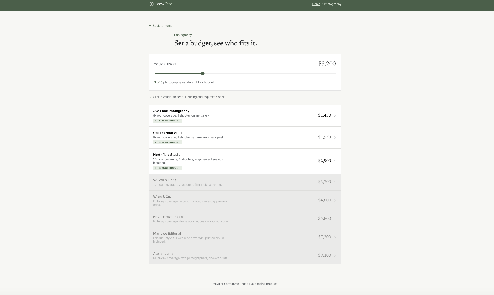
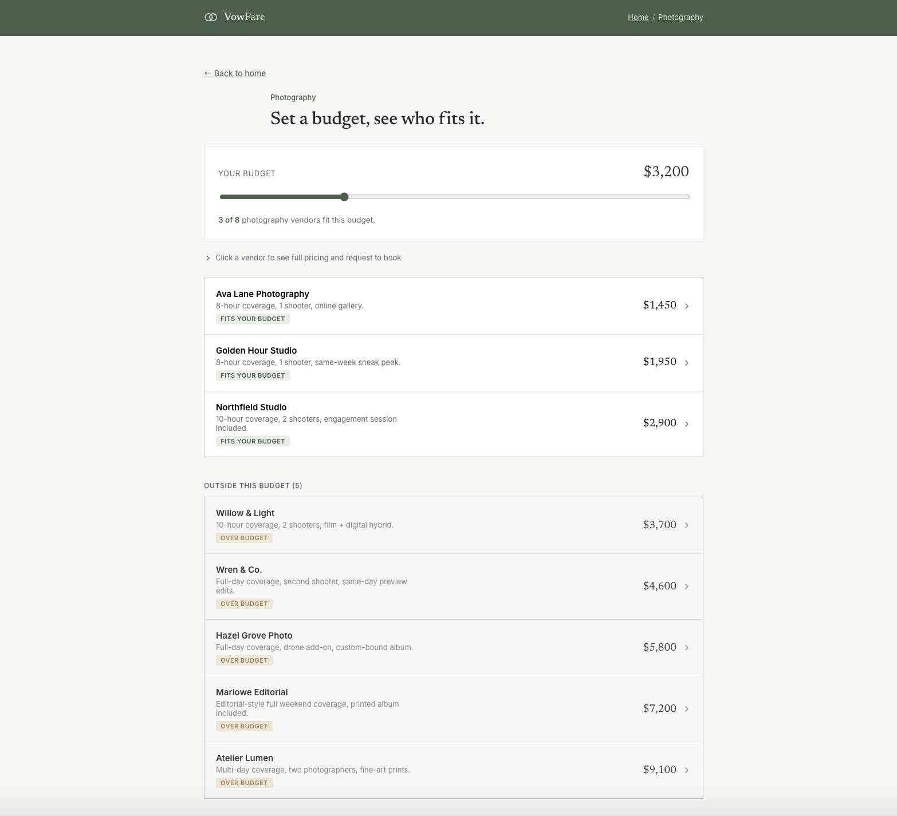

# VowFare

A three-screen interactive mockup for VowFare, a platform where couples can set a budget for each wedding vendor category, see which vendors fit their budget, and book directly.

**Live prototype:** https://kenziemw.github.io/Vow-Fare-Makenzie-Whitman/

## 1. Need, Persona, Capability, and Value

**Need:** Couples often do not know how much wedding vendors actually cost. They usually have to reach out to multiple vendors and wait for responses before they know if something is even within their budget.

**Persona:** A newly engaged couple who is 4 to 8 months away from their wedding, has full-time jobs, and is planning mostly during evenings and weekends. They also have not chosen a venue yet.

**Capability:** See and compare vendors in a specific category that fit within a budget you set.

**Value:** Certainty. Couples can know what they can actually afford before spending time contacting vendors or getting attached to an option.

## 2. The Three Screens

### 1. Landing Page

The landing page is meant to quickly explain what VowFare does. The main question it answers is: **Does the page clearly communicate that you can set a budget, see vendors that fit it, and book directly?**

### 2. Budget → Matches

This screen shows the main feature of the website. Couples can set a budget and guest count and then see vendors that fit their budget. The main question is whether the vendors feel like actual matches for the user's budget instead of just looking like another vendor directory.

### 3. Vendor Profile

This screen shows the payoff of the platform. It gives the user a clear price breakdown and an option to request to book. The main question is whether the pricing feels clear and final, instead of making the user feel like they still need to negotiate with the vendor.

## 3. Design Questions and Predictions

### Need

**Question:** "Tell me about the last time you started looking for a wedding vendor, like a photographer or caterer. What happened, and what did you end up doing?"

**Prediction:** I think they will talk about contacting several vendors through Instagram or a wedding website, waiting for responses, and not getting actual pricing right away. Some might even say they chose a vendor because they responded the fastest instead of because they were the best fit for their budget.

**What this tests:** Whether the instant pricing on Screen 2 actually solves the problem of not knowing prices upfront.

### Value

**Question:** "If you could see the pricing upfront and know what you can afford before contacting anyone, what would that be worth to you in a word or two?"

**Prediction:** I expect answers like "peace of mind," "confidence," or "control." If people mostly say "convenience" or "easier," then we may actually be solving a different problem than we thought.

**What this tests:** Whether the budget slider and filtered vendors on Screen 2 actually make the idea of certainty feel useful.

### Persona

**Question:** "How often does wedding planning come up for you right now? Are you usually sitting down specifically to plan, or are you doing it in between other things?"

**Prediction:** I think most people will say they plan a few times a week in small chunks of time, like late at night or during work breaks, instead of having a dedicated planning session.

**What this tests:** Whether the "no back-and-forth" message on the landing page is actually valuable for someone who has limited time to plan.

### Capability

**Question:** "I'm going to show you this for five seconds and then hide it. What do you think this lets you do?"

**Prediction:** I think people will say something like "see vendors that fit my budget" but may not mention booking. If that happens, the booking option on Screen 3 may need to stand out more.

**What this tests:** Whether the main feature is clear enough when someone only sees the screen for a few seconds.

## 4. Design Justification and First Read

**The affordance sentence:** The one thing a first-time visitor needs to walk away with on the landing screen is: *"Set a budget for each vendor, see who actually fits it, and book them directly — no emailing around, no waiting on quotes."* Everything else on that screen either says this directly (headline, subheading) or gets people moving toward it (the "Set your budget" button and the category grid).

When I opened the live prototype, I think the landing page mostly communicates the main idea right away. There is one main headline, a short subheading, and a primary "Set your budget" button. The category grid below it supports the same main action, so I do not think it takes away too much from the main purpose of the page.

The main thing I would want to test again is the category grid because it is the only part of the landing page that could compete with the main button for attention.

On Screen 2, the guest count and budget sliders are grouped together in one bordered section. This uses **common region** to show that they are connected and work together as filters. The vendor cards also have the same design, which uses **similarity** to make them feel like one group of options.

On Screen 3, the price breakdown is separated into its own bordered section. This helps the pricing stand out from the other information on the page and uses **common region** to group the numbers together.

I also made sure that Screens 2 and 3 have clear ways to go back. Screen 2 has the logo, breadcrumb, and a "← Back to home" link. Screen 3 has the logo, breadcrumb, and a "← Back to matches" link.

### Changes I Made

There were two main things the AI got wrong or oversimplified.

**1. The vendor cards did not look clickable.**

The cards were technically clickable, but there was nothing that really showed the user they could click them. They looked more like static pricing information.

**Fix:** I added a short message above the list saying, "Click a vendor to see full pricing and request to book." I also added a chevron to each vendor card so it is more obvious that the cards are interactive.

**2. Vendors outside the budget were not separated clearly enough.**

Originally, vendors that were outside the budget were just shown with lower opacity in the same list. This was easy to miss and could make the cards look like they were broken rather than intentionally outside the budget.

**Fix:** I separated the vendors into two sections: "Fits your budget" and "Outside this budget (n)." This makes the difference much easier to understand because the groups are physically separated and clearly labeled.

The first change was mainly an **affordance problem** because users were not given a clear signal that the cards were clickable. The second was a **grouping problem** because the difference between vendors within and outside the budget needed to be more obvious.

## Before / After

**Before:** Vendors outside the budget were faded using opacity and were mixed into the same list as vendors that fit the budget.

**After:** Vendors outside the budget are separated into their own labeled section, making it much easier to see which vendors fit the budget.

The main problem was not that the original design looked generic. The bigger issue was that the original list relied on a subtle opacity difference to show which vendors fit the budget. That could easily be missed, especially when quickly looking through the page. Separating the vendors into two groups and showing the number of vendors outside the budget makes the difference much clearer.
